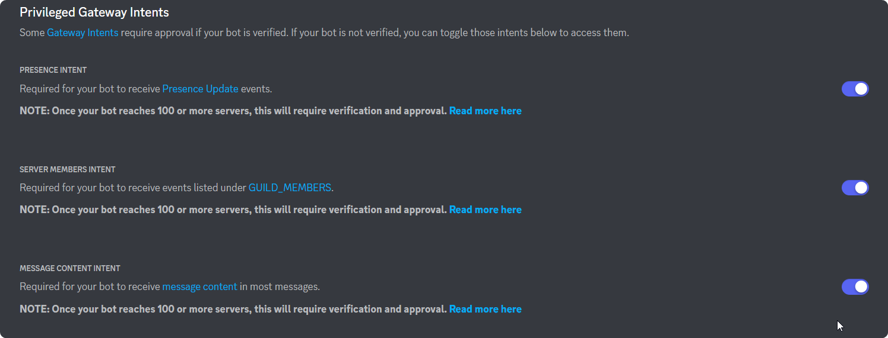

# Custom Bots

Get more customization with your own instance of Beep Boop, name it whatever you want put on whatever avatar you want, it's your bot.

## Setting up your custom bot

First off, head over to the [Discord Developer Portal](https://discord.com/developers) and create a new application.

.png>)

After you finish creating your application you can customize your app. Once your done customizing your app you can create a bot user for your app.

### IMPORTANT: Enable Privileged Gateway Intents

For your custom bot to work, you'll need to enable Privileged Gateway Intents.

<figure><figcaption>
Gateway Intents Enabled
</figcaption></figure>

