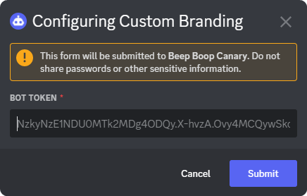

# Custom Bots

Get more customization with your own instance of Beep Boop, name it whatever you want put on whatever avatar you want, it's your bot.


Disclaimer: Your custom bot won't get a verified check.

.png>)


## Setting up your custom bot

First off, head over to the [Discord Developer Portal](https://discord.com/developers) and create a new application.

.png>)

After you finish creating your application you can customize your app. Once your done customizing your app you can create a bot user for your app.

### IMPORTANT: Enable Privileged Gateway Intents

For your custom bot to work, you'll need to enable Privileged Gateway Intents.

<figure><figcaption>
Gateway Intents Enabled
</figcaption></figure>

### Setting up your custom bot on Beep Boop

Head back onto Discord, go to the server you want your bot to primarily be, and use `/subscription`, you should see a few buttons and your information about your subscription.

Once you've finished looking around, click on `Custom Branding` and click new bot or/and a modal will show up, like this one:

Enter your bot token you got from the Discord Developer Portal up [here](custom-bots.md#setting-up-your-custom-bot), select a log channel, and...   Your bot's online!
